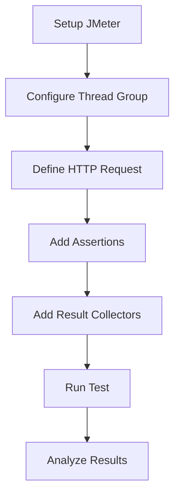
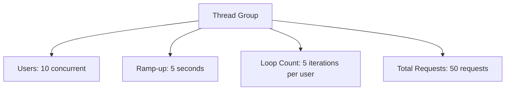
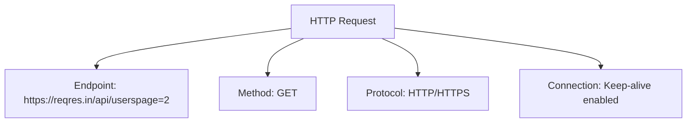
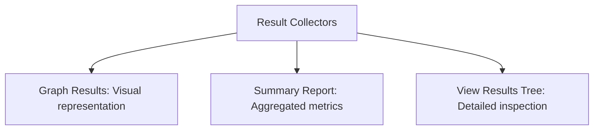
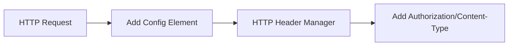

# JMeter GET Request Simulator

[](https://opensource.org/licenses/MIT)
[](https://jmeter.apache.org/)
[](https://reqres.in/)
[](https://github.com/ajeetraina/JMeter-GET-Simulator/graphs/commit-activity)
[](https://github.com/ajeetraina/JMeter-GET-Simulator/stargazers)
[](https://github.com/ajeetraina/JMeter-GET-Simulator/network/members)
[](https://github.com/ajeetraina/JMeter-GET-Simulator/issues)

A performance testing project using Apache JMeter to simulate HTTP GET requests and analyze API performance.

## Overview

This repository contains a JMeter test plan designed to simulate and evaluate the performance of RESTful API GET requests. The test plan is configured to:

-  Send concurrent GET requests to retrieve user data from a RESTful API
-  Apply appropriate assertions to validate responses
-  Collect performance metrics using various listeners

## Workflow



## Test Configuration

### Thread Group Setup



-  **Users (Threads)**: 10 concurrent users
-  **Ramp-up Period**: 5 seconds
- **Loop Count**: 5 iterations per user
-  **Total Requests**: 50 requests (10 users  5 iterations)

### HTTP Request Details



- **Endpoint**: https://reqres.in/api/userspage=2
- **Method**: GET
- **Protocol**: HTTP/HTTPS
- **Connection**: Keep-alive enabled for better performance

###  Assertions

Response assertions have been configured to verify:
- Response contains "email" field
- Successful HTTP status codes

###  Performance Monitoring



The test plan includes multiple result collectors:

1. **Graph Results**: Visual representation of response times and throughput
2. **Summary Report**: Aggregated test metrics including:
   - Average response time
   - Min/Max response times
   - Throughput (requests/second)
   - Error rate percentage
3.  **View Results Tree**: Detailed inspection of individual requests and responses

##  Test Results

Initial test results with 10 concurrent users and 5 iterations each showed:

-  Successful simulation of concurrent API requests
-  Acceptable average response times
-  Low error rate under the tested load
-  Proper validation of response data

##  How to Run

###  Prerequisites
-  Java 8 or higher installed on your system
-  Apache JMeter (v5.6.3 or later recommended)

###  Installation Steps

1. **Install Java** 
   - Download and install Java from [Oracle's website](https://www.oracle.com/java/technologies/javase-downloads.html) or use OpenJDK
   - Verify installation with `java -version`

2. **Install Apache JMeter** 
   - Download JMeter from [Apache JMeter website](https://jmeter.apache.org/download_jmeter.cgi)
   - Extract the downloaded archive to a location on your system
   - On Windows: Run `bin/jmeter.bat`
   - On macOS/Linux: Run `bin/jmeter.sh`

3. **Clone the Repository** 
   ```bash
   git clone https://github.com/ajeetraina/JMeter-GET-Simulator.git
   cd JMeter-GET-Simulator
   ```

4. **Run the Test** 
   - Open JMeter GUI
   - File > Open and select the `Thread Group.jmx` file
   - Click the Run button (green play button) or press Ctrl+R to start the test

###  Viewing Results

Results are displayed in real-time through the configured listeners:
-  Check "Graph Results" for visual performance data
-  Review "Summary Report" for aggregate metrics
-  Inspect "View Results Tree" for detailed request/response information

##  Test Customization

To adapt this test plan for your own API testing:

1. **Modify the HTTP Request** 
   - Double-click on the HTTP Request element
   - Update the Server Name/IP and Path fields
   - Adjust HTTP method if needed

2. **Adjust Thread Group Settings** 
   - Change the number of threads (users) to simulate different loads
   - Modify loop count to increase/decrease test duration
   - Adjust ramp-up period based on your test requirements

3. **Update Assertions** 
   - Modify or add response assertions to validate your API's responses
   - Configure pattern matching based on your expected results

##  Advanced Configuration

###  Adding Headers



To add headers like authentication tokens:
1. Right-click on HTTP Request > Add > Config Element > HTTP Header Manager
2. Add headers as needed (e.g., Authorization, Content-Type)

###  Response Timing Thresholds

To set performance thresholds:
1. Right-click on HTTP Request > Add > Assertions > Duration Assertion
2. Set maximum allowed duration in milliseconds

##  Use Cases

This simulator can be used for:

-  API performance testing
-  Load capacity evaluation
-  Response time analysis
-  Reliability testing
-  Error handling validation

##  Related Projects

If you need more advanced setups, check out the [jmeter-docker](https://github.com/ajeetraina/jmeter-docker) repository for setting up JMeter in a distributed Docker environment.

##  License

This project is licensed under the MIT License - see the LICENSE file for details.
